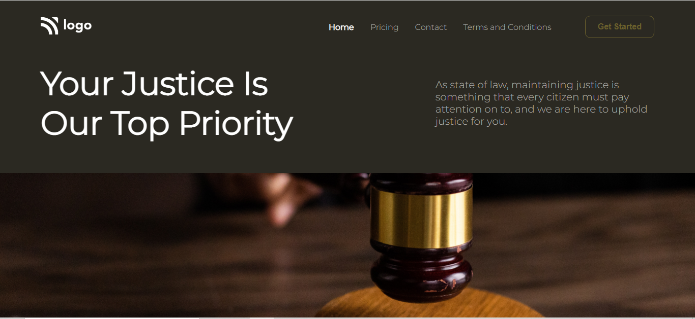

# Law Home Page

**Hi everyone, I am Raushan Kumar.**

>This landing page was coded as a part of the ongoing JavaScript Web Developer Bootcamp by [iNeuron](ineuron.ai) in pure HTML and CSS😎.  

This project taught me more about the powerful usage of Flexbox and background property😃. I used several new properties of background and flexbox whom I was unware of to design the layout of webpage and it was pretty fun and a lot of learning👍.
 
Learning from the project:
 - Background Image
 - Background Position
 - Margin and Padding
 - Flexbox direction

**Challenges** 👉 This project required the knowledge of background properties of the CSS to put the background image in place along with the padding and margin for the banner. This gave the experience of working with banner type components with a background image. Little bit of tweaking the values of margin and padding gave the desired view of the banner. Also, I learnt the skill of designing attractive buttons that I was completely afraid of in the beginning. Overall, the project was more of a learning experience than being thought as a challenge🤟.
 
>**This project took me around 3 hours to complete and was completed without much hassle. Overall a very good beginner project to learn CSS**
 

Below is the link and the view of the page👇
[Law-Home](https://law-home.netlify.app/)

